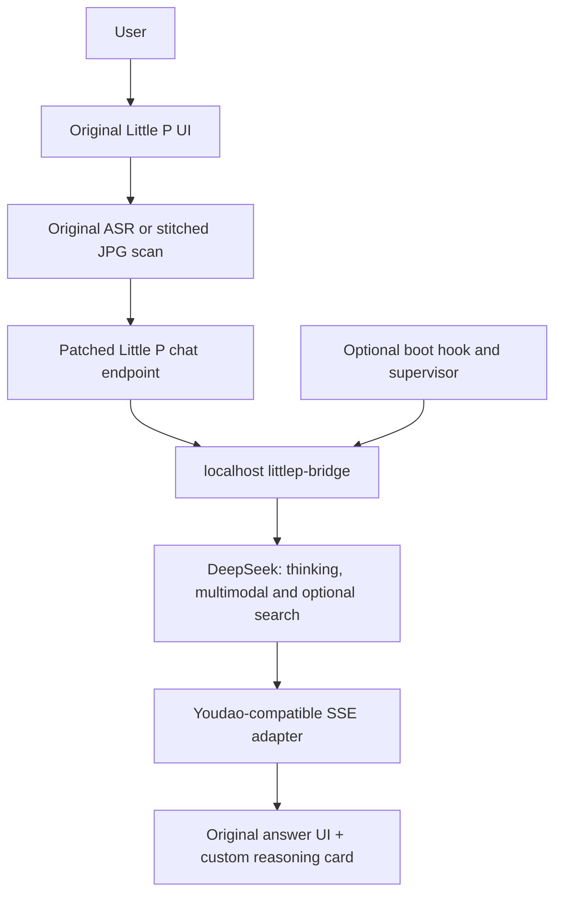

# littlep-deepseek

[中文](README.zh-CN.md)

An unofficial community project that replaces the AI backend of **Youdao Dictionary Pen X6 Pro's Little P assistant** with DeepSeek, preserving its original UI, voice input and stitched-image scanning.

**Supported:** YDPX6-2 CHN PLUS, Dictionary Pen OS 4.3.5, Little P 2.3.6; exact file hashes are required. All other models, versions and slots are untested. This project is not affiliated with or endorsed by NetEase Youdao or DeepSeek.

## What changes

A narrowly scoped native patch redirects only Little P's chat SSE request to `http://127.0.0.1:18181`. A project-authored page wrapper adds a reasoning card; ordinary answers use the original renderer. A Go bridge translates requests and streams responses. An optional supervisor uses an existing writable boot hook. Rootfs, OCR, ASR, capture, audio services, certificates and DNS are not replaced.

This source repository contains **no vendor firmware, original or patched vendor ELF/bytecode, original app bundle, fonts, certificates, user scans, device logs, screenshots or real API keys**. Obtain the required original files from your own device; generated payloads and backups remain private. No authentication bypass is provided.

## Features

- Original Little P UI and ASR; native multimodal input from its original stitched JPG.
- DeepSeek API `reasoning_content` streaming in a custom folding/scrolling card, with streaming final answers in the original UI.
- Model-selected native web search, search status and structured sources.
- Multi-turn text, recent-image and search-source context; session isolation, cancellation and complete-pair trimming.
- Loopback-only service, autostart, single-instance supervisor, crash recovery and disable/rollback controls.

No initial system prompt is injected. API reasoning is not saved as historical context. **TTS is not implemented and is intentionally out of scope.**

## Architecture



## Requirements

- A legally owned supported device with an already authorized root ADB shell; this repository does not obtain root or authenticate it.
- Go 1.20+ (packaging tested with Go 1.27.1), Python 3.10+, Node.js 18+, ADB and POSIX shell/make; WSL is recommended for Windows development.
- A private DeepSeek key, API access and Wi-Fi. Search/vision availability depends on the configured model and API account.
- For the page patch, the exact compatible **user-supplied** QuickJS compiler identified in [patch/README.md](patch/README.md). It is not distributed here.

## Quick start

Run from this repository. `DEVICE_SERIAL` means your ADB serial, not a value supplied by this project. Never commit it or private files.

```sh
make test
make build
make verify
# Read-only identity/hash check; no installation:
python3 deploy/device.py check --serial "$DEVICE_SERIAL"
# Obtain private originals, preserving the libs/ directory:
mkdir -p private/original-app/libs
adb -s "$DEVICE_SERIAL" pull /userdisk/miniapp/data/mini_app/pkg/8001707294117702/b/libs/libbusiness_littlep_1755531922.so private/original-app/libs/
adb -s "$DEVICE_SERIAL" pull /userdisk/miniapp/data/mini_app/pkg/8001707294117702/b/RobotMessage-e079798d.js.bin private/original-app/
adb -s "$DEVICE_SERIAL" pull /userdisk/miniapp/data/mini_app/pkg/8001707294117702/b/manifest.json private/original-app/
python3 patch/scripts/patch.py --app private/original-app --dry-run
# Run this full page compilation with Windows Python and your Windows compiler:
python patch/scripts/patch.py --app private/original-app --qjsc /path/to/qjsc.exe --output payload
cp config/config.example.json private/config.json
# Edit private/config.json locally: set your key. Keep the listen port unchanged.
python3 deploy/device.py install --serial "$DEVICE_SERIAL" --payload payload --config private/config.json
```

The installer verifies identity, exact original hashes and payload hashes, requires `APPLY`, pulls a full private app/registry backup with metadata, starts a healthy bridge, then changes only the allowlisted app files. It refuses unknown files, existing bridge directories and occupied hooks. It never kills the UI or reboots. Perform a **normal device restart** yourself to reload the plugin; test Little P before enabling autostart. After that restart, manually start the bridge once before the functional test:

```sh
# Re-enable your already authorized ADB connection through the normal device procedure:
adb -s "$DEVICE_SERIAL" shell /userdisk/littlep-bridge/start.sh
adb -s "$DEVICE_SERIAL" shell /userdisk/littlep-bridge/status.sh
```

This manual start is needed until the boot hook is enabled. Details: [installation](docs/install.md).

```sh
# After a successful manual functional check; use the actual backup printed by install:
python3 deploy/device.py autostart --serial "$DEVICE_SERIAL" --backup backup/<timestamp>
adb -s "$DEVICE_SERIAL" shell /userdisk/littlep-bridge/status.sh
make package
```

`make package` produces a source-only ZIP in `dist/`, not a deployment payload. These commands do not publish anything.

## Recovery / rollback

```sh
python3 deploy/device.py rollback --serial "$DEVICE_SERIAL" --backup backup/<timestamp>
```

Rollback requires confirmation, verifies both current files and the backup, disables the service, removes only this project's verified hook/new dependency, and restores original contents, owner and mode. It preserves the backup and bridge directory. A normal restart reloads the original library. See [rollback](docs/rollback.md) and [troubleshooting](docs/troubleshooting.md).

## Configuration and limitations

Use [config/config.example.json](config/config.example.json). Key/base/model/listen/context budget/search/search limit/log level are configurable. Standalone listen supports explicit loopback IPs; integrated deployment requires **127.0.0.1:18181** to match the native patch and supervisor. HTTPS API base only. No live API calls are part of CI.

The private r7 lineage passed device acceptance, including two ordinary reboots, recovery, disable/enable and USB-disconnected use. **This cleaned, configurable source package has been tested locally, not reinstalled on the device during packaging.** New deployment tooling needs cautious independent device validation. The page compiler is an external exact-version prerequisite, not a reproducible open toolchain claim. Firmware/app updates may invalidate hashes or overwrite patches. Memory-only sessions clear at restart; no long-term memory. Formula rendering is a compatibility conversion, not a general LaTeX engine. No power-loss robustness or secure multi-user network service is claimed.

## Documentation

- [Supported device](docs/supported-device.md), [architecture](docs/architecture.md), [protocol](docs/protocol.md)
- [Multimodal scanning](docs/multimodal.md), [web search](docs/web-search.md), [context](docs/context.md)
- [Autostart](docs/autostart.md), [development](docs/development.md), [patch tools](patch/README.md)
- [Change log](CHANGELOG.md), [security](SECURITY.md), [contributing](CONTRIBUTING.md)
- [Readiness assessment](OPEN_SOURCE_READINESS.md), [security audit](SECURITY_AUDIT.md), [third-party notice](NOTICE.md)

## License

[Apache-2.0](LICENSE) covers project-authored bridge, supervisor, scripts and patch logic. It does not license any vendor firmware/software, compiler, API service or trademark. See [NOTICE.md](NOTICE.md). Keep user-provided originals and generated derivative payloads private.
