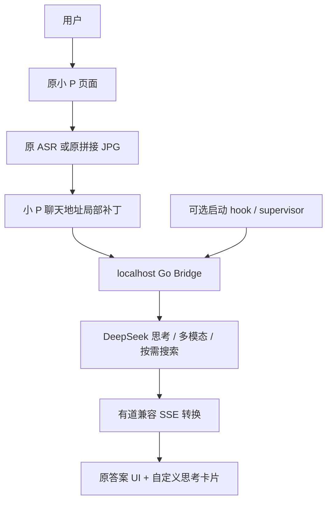

# littlep-deepseek

[English](README.md)

这是一个非官方社区项目：将网易有道词典笔 X6 Pro 原“小 P 老师”的 AI 后端接入 DeepSeek，保留原页面、语音输入及拼接 JPG 扫描链。

**仅支持已经验证的组合：YDPX6-2 CHN PLUS、词典笔 OS 4.3.5、小 P 2.3.6、指定原文件 SHA256。** 其他型号、系统、应用版本与槽位均未经测试。本项目与网易有道、DeepSeek 无官方关联，也未获得它们的认可。

## 修改范围与仓库内容

原生库的小范围补丁只将小 P 聊天 SSE 地址改为 `http://127.0.0.1:18181`。项目原创页面包装器提供思考卡片，最终答案仍调用原页面组件。Go Bridge 转换协议；可选 supervisor 借助设备原有可写启动入口管理服务。

根文件系统、OCR、ASR、图像捕获、音频系统、证书和 DNS 保持原有实现。仓库不提供 Root 或 ADB 认证方法。

仓库**不包含**有道固件、原始或修改后的专有 ELF/字节码、完整应用、图片/字体/证书、真实扫描题、用户日志、设备截图或真实 Key。用户需从自己拥有的设备提取指定原文件；生成的派生文件与备份只能保留在自己的私有目录。

## 已完成能力

- 原小 P UI、原 ASR、原拼接 JPG 直接用于 DeepSeek 原生多模态。
- API 返回的 `reasoning_content` 真流式显示，支持折叠、内部滚动；最终答案走原 UI 并流式显示。
- 模型按需调用原生联网搜索，显示状态及结构化来源。
- 文字多轮、最近图片追问、来源追问、新话题隔离、取消丢弃半轮、完整轮次裁剪。
- localhost 单实例、开机自启动、崩溃恢复、启停禁用及回滚。

不注入初始 system prompt。历史不保存 reasoning。**不实现 TTS，TTS 明确不在项目范围内。**

## 架构



## 前置条件

- 合法拥有的支持设备，以及已授权的 root ADB shell；本仓库不取得这些权限。
- Go 1.20+（本次整理使用 1.27.1）、Python 3.10+、Node.js 18+、ADB、POSIX shell 和 make。Windows 可在 WSL 开发。
- 私有 DeepSeek API Key、API 账户访问能力和设备 Wi-Fi；具体模型的搜索/视觉能力取决于服务。
- 页面补丁需要用户自行提供严格匹配的 QuickJS 编译器，见 [Patch 说明](patch/README.md)。仓库不分发该编译器。

## 快速开始

在仓库根目录运行。`DEVICE_SERIAL` 是用户自己的 ADB 序列号，不能提交到仓库。

```sh
make test
make build
make verify
python3 deploy/device.py check --serial "$DEVICE_SERIAL"
mkdir -p private/original-app/libs
adb -s "$DEVICE_SERIAL" pull /userdisk/miniapp/data/mini_app/pkg/8001707294117702/b/libs/libbusiness_littlep_1755531922.so private/original-app/libs/
adb -s "$DEVICE_SERIAL" pull /userdisk/miniapp/data/mini_app/pkg/8001707294117702/b/RobotMessage-e079798d.js.bin private/original-app/
adb -s "$DEVICE_SERIAL" pull /userdisk/miniapp/data/mini_app/pkg/8001707294117702/b/manifest.json private/original-app/
python3 patch/scripts/patch.py --app private/original-app --dry-run
# Run this full page compilation with Windows Python and your Windows compiler:
python patch/scripts/patch.py --app private/original-app --qjsc /path/to/qjsc.exe --output payload
cp config/config.example.json private/config.json
# 本地编辑 private/config.json，填写 Key；保持监听地址和端口。
python3 deploy/device.py install --serial "$DEVICE_SERIAL" --payload payload --config private/config.json
```

安装前必须正常退出小 P。脚本显示型号、版本及目标路径，验证原文件和生成文件摘要，要求输入 `APPLY`，完整提取私有小 P 目录和注册元数据，记录文件权限及摘要，健康检查通过后才写指定页面/插件文件。遇到未知版本、已存在 Bridge 目录、占用 hook 或不匹配文件立即停止。脚本不杀 UI、不重启。

由用户正常重启设备加载新插件，按平常方式重新启用已授权的 ADB。此时还未启用开机入口，需先手动启动一次 Bridge：

```sh
adb -s "$DEVICE_SERIAL" shell /userdisk/littlep-bridge/start.sh
adb -s "$DEVICE_SERIAL" shell /userdisk/littlep-bridge/status.sh
```

完成语音、扫描、搜索、多轮验收后，再启用开机入口：

```sh
# 使用安装时打印的真实备份目录：
python3 deploy/device.py autostart --serial "$DEVICE_SERIAL" --backup backup/<timestamp>
adb -s "$DEVICE_SERIAL" shell /userdisk/littlep-bridge/status.sh
make package
```

`make package` 只生成 `dist/` 中的源码 ZIP，不是设备安装包，也不会上传。详细流程见 [安装](docs/install.md)。

## 恢复与回滚

```sh
python3 deploy/device.py rollback --serial "$DEVICE_SERIAL" --backup backup/<timestamp>
```

脚本先校验备份和当前文件，要求显式确认，停用服务，只移除本项目且摘要匹配的启动入口和新增依赖，恢复原文件内容、owner 和 mode。备份及 Bridge 目录保留。正常重启后加载原库。见 [回滚](docs/rollback.md) 和 [故障处理](docs/troubleshooting.md)。

## 配置与限制

[配置示例](config/config.example.json) 支持 Key、API Base、模型、监听地址、上下文预算、搜索开关、搜索次数及日志级别。Bridge 独立运行只接受明确 localhost IP；设备集成必须使用 **127.0.0.1:18181**，与原生补丁及 supervisor 保持一致。上游只接受 HTTPS；CI 不调用真实 API。

默认上下文预算 128K，输出预留 16K。仅内存历史，重启即清空；只保存 user 和 assistant 最终正文，最近一张原图及最近来源单独保留，不提供长期记忆。

私有 r7 稳定谱系已通过设备验收，包括两次普通重启、崩溃恢复、禁用恢复和断开 USB 使用。**本次整理的配置化源码包只做本地测试，没有重新部署设备。** 新安装工具仍需用户在自己设备上谨慎独立验证。页面工具链依赖外部精确版本编译器，不声称完整开放工具链可复现。系统或应用更新可能使摘要失效或覆盖补丁。公式转换并非通用 LaTeX 引擎。没有测试断电冷启动，也不是可暴露到局域网的多用户服务。

## 文档与许可

[支持设备](docs/supported-device.md) · [架构](docs/architecture.md) · [协议](docs/protocol.md) · [扫描](docs/multimodal.md) · [搜索](docs/web-search.md) · [上下文](docs/context.md) · [自启动](docs/autostart.md) · [开发](docs/development.md)

[变更记录](CHANGELOG.md) · [贡献](CONTRIBUTING.md) · [安全](SECURITY.md) · [安全审计](SECURITY_AUDIT.md) · [发布就绪评估](OPEN_SOURCE_READINESS.md)

[Apache-2.0](LICENSE) 只覆盖项目原创 Bridge、supervisor、脚本和补丁逻辑，不覆盖有道程序、固件、编译器、API 服务或第三方商标。见 [NOTICE.md](NOTICE.md)。用户提取的原文件及生成的派生文件必须保持私有。
